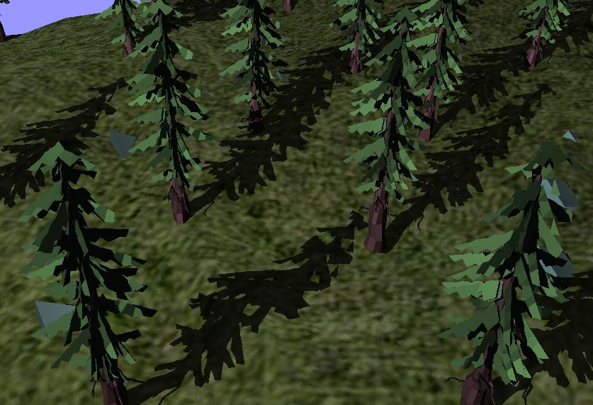
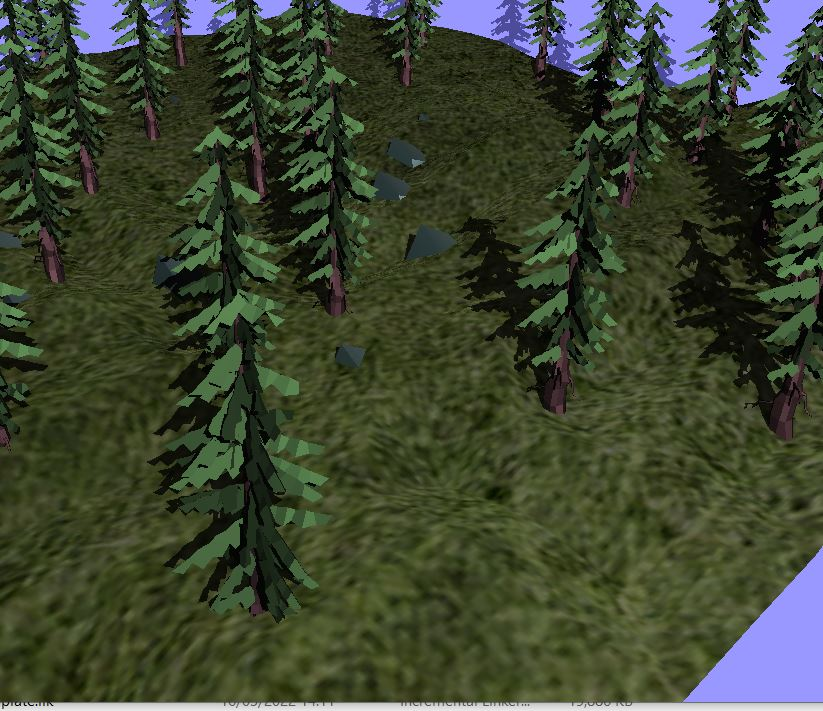

# COMP3015 Volumetric Shadows
This Project was created using Visual Studio 2019.
This project shows of a render pipeline for rendering volumetric shadows on a procedurally generated forest, every time you reopen the project a new forest will be created.

You can watch a video on the project here:[Video](https://www.youtube.com/watch?v=-De1vGtzqUM&ab_channel=JamesMountford)

The Process for rendering Geometric shadows involves the geometry shader, which creates the shadow volumes. There are 3 steps to the shadow rendering:

Step 1: the scene is rendered normally but the ambient components are stored in one buffer and the diffuse and specular are stored in another. 
Step2: The stencil buffer is set up so that only shadow casting objects are rendered but only there shadows are passed to the fragment shader
step3: The stencil buffer combines the two buffers from step one,

## How to run
download the repo then run the forest.exe shortcut.

or run the project application shortcut to see the code

Github: [link](https://github.com/jamount/Comp3015)
